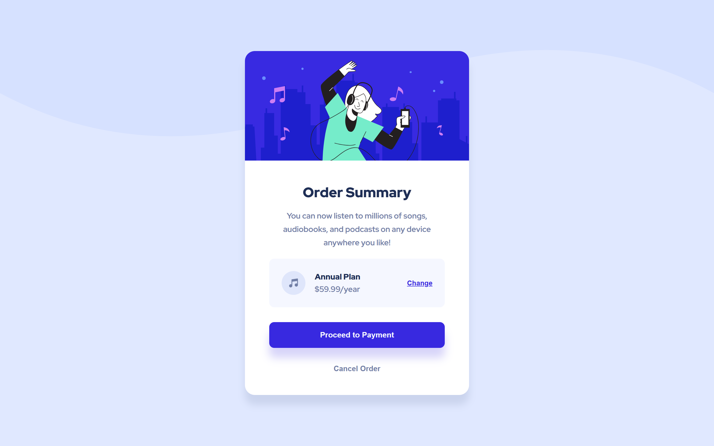

# Frontend Mentor - Order summary card solution

This is a solution to the [Order summary card challenge on Frontend Mentor](https://www.frontendmentor.io/challenges/order-summary-component-QlPmajDUj). Frontend Mentor challenges help you improve your coding skills by building realistic projects. 

## Table of contents

- [Overview](#overview)
  - [The challenge](#the-challenge)
  - [Screenshot](#screenshot)
  - [Links](#links)
- [My process](#my-process)
  - [Built with](#built-with)
  - [What I learned](#what-i-learned)
  - [Continued development](#continued-development)
  - [Useful resources](#useful-resources)
  - [AI Collaboration](#ai-collaboration)
- [Author](#author)
- [Acknowledgments](#acknowledgments)

## Overview

### The challenge

Users should be able to:

- See hover states for interactive elements

### Screenshot

### Links

- Solution URL: [Solution URL](https://github.com/Faith-Rose1/order-summary-card)
- Live Site URL: [Live Site URL](https://faith-rose1.github.io/order-summary-card/)

## My process

### Built with

- Semantic HTML5 markup
- CSS custom properties
- Flexbox
- Mobile-first workflow
- sass
- BEM

### What I learned

- still trying to build a good memory of using sass in project to get the hang of it.

### Continued development

- Still going to learn more about Sass and BEM.

### Useful resources

- Used this site to download the fonts > https://gwfh.mranftl.com/fonts .

### AI Collaboration

- Asked gemini from time to time about accessibility , sass and BEM and if everything looks good.

## Author

- Frontend Mentor - [@Faith-Rose1](https://www.frontendmentor.io/profile/Faith-Rose1)

- Instagram: [@bluebutterfly00777](https://www.instagram.com/bluebutterfly00777/)

- Twitter: [@ButterflyNana7](https://x.com/ButterflyNana7)

## Acknowledgments
